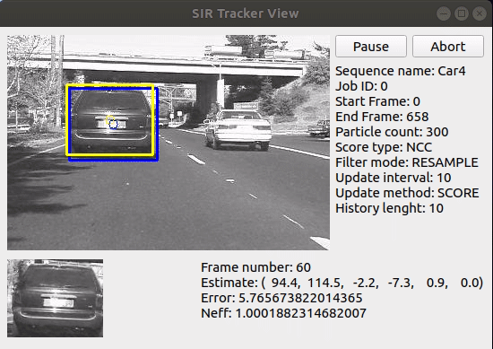
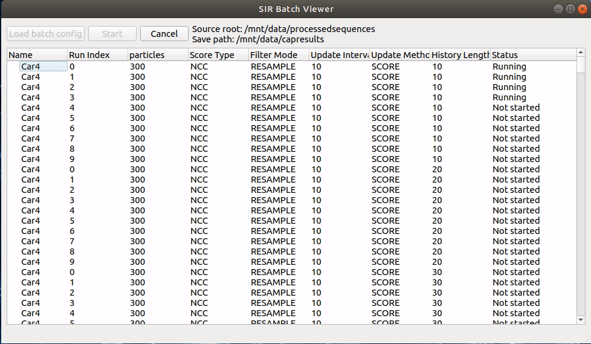
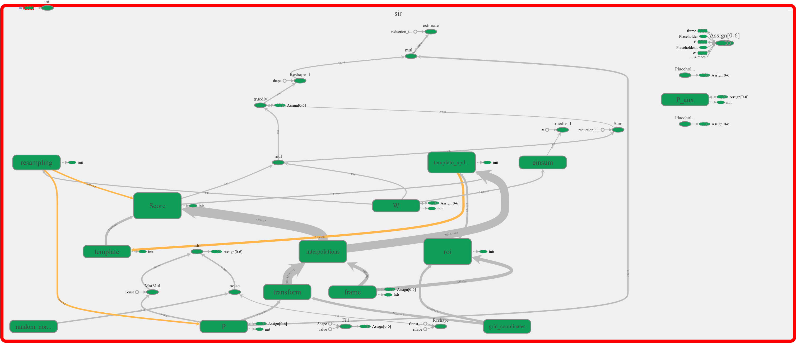
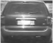

My particle filter tracker with SVD template on GPU
===================================================
This is the code that I used to generate the results discussed in my dissertation on the title topic.

My intent was to familiarize myself with Tensorflow and Python while at the same time fulfilling my dissertation research requirements.

The bulk of the code can be found in the sirlib folder, it has a QT5 GUI interface for the batch runner and the single-job Heads-up-display style interface.

This was fun!

Tracker Monitor GUI
------------------

Batch Run Interface
---------------

TensorFlow Graph
----------------

Example of SVD generated template
--------------------------
